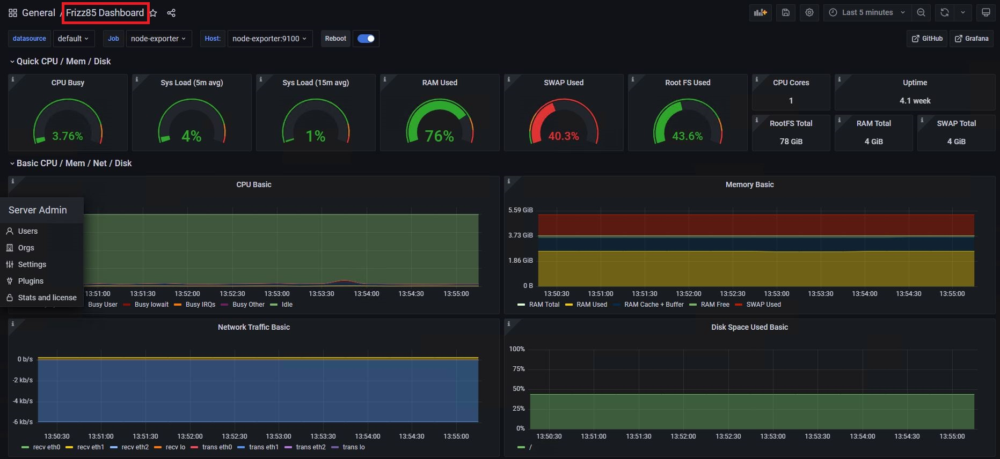

# Домашнее задание "Настройка мониторинга"

## Описание/Пошаговая инструкция выполнения домашнего задания:

Настроить дашборд с 4-мя графиками

   -  память;
   -  процессор;
   -  диск;
   -  сеть.
    
Настроить на одной из систем:
* zabbix (использовать screen (комплексный экран);
* prometheus - grafana.

Использование систем, примеры которых не рассматривались на занятии \*
Список возможных систем был приведен в презентации.
    
В качестве результата прислать скриншот экрана - дашборд должен содержать в названии имя приславшего.

### Установка с помощью docker-compose

```
docker stack deploy -c docker-compose.yml
```


### Доступы к системам

Dashboard Prometheus
http://10.101.83.103:9090

Метрики самого Prometheus
http://10.101.83.103:9090/metrics

Grafana
http://10.101.83.103:3000/
Login: admin/admin

Grafana dashboard
http://10.101.83.103:3000/d/rYdddlPWk/frizz85-dashboard?orgId=1



1. ./docker-compose.yml - файл установки для разворачивания системы
2. ./prometheus.yml - настройки Prometheus
3. ./node-exporter-full_rev30.json - настройка dashbord Grafana
4. ./node-exporter.yml - настройка node-exporter
